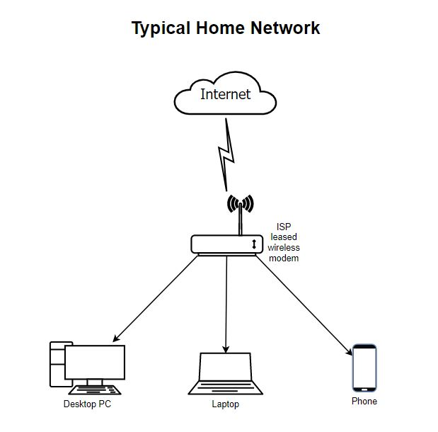
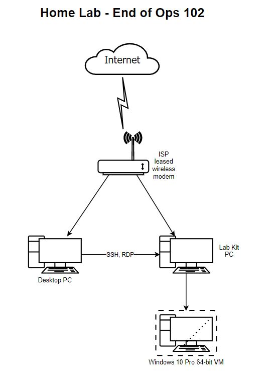

# Lecture Notes: What is a Computer?

Use this document to add more details, flavor, hints, tricks, ideas to make lecture better. This should tie into the "Why, What, How" sections of the facilitator's README.

Consider the [README](README.md) in conjunction with the [DEMO](DEMO.md) as the single source of truth for a given class, while this document is more of the living, breathing, set of notes from all instructors as to what is historically working well.

David Lee 7/8/2020 - Students really appreciated the Binary slide deck the most, because of the easy method taught. They also appreciated when I connected the circuit on/off concept back to how binary is 1 and 0 (on or off).

# Topic 1: Welcome Slides

Present the welcome slide deck with an emphasis on the "learning pit" slide.

# Topic 2: What is a computer?

- What is the objective of Ops 102?
  - Get to know your lab kit PC and deploy a basic homelab
  - Here's what your home network probably looks like:

  

  - In this course, we'll be deploying the lab kit PC to your home network and using it as a virtualization server. 

  

  - Share these download links with students:
    - Ubuntu 20.10 Desktop ISO
    - Windows 10 ISO
    - UNetbootin Installer

  - We'll need to first start by understanding the components of your lab kit PC.

- Why study computer components?
  - Low level security threats
  - For your homelab, understand computer resource allocation vs. performance
  - It is true that most of this gets abstracted away
- What is a computer to you?
  - Whiteboard activity
    - Computer components
    - Processes
  - What is the core function of a computer?
    - Input information
    - Store information
    - Process information
    - Output information
- How? Manipulate electricity
- Levels of abstraction in computing
  - Physical (start 102 here - where you are now)
  - Electronic transmission of binary signals
  - Components in an electronics board
  - Connecting hardware components
  - Basic input-output system (BIOS)
  - Operating system (OS)
  - Virtualization (finish 102)
  - Server
  - Network
  - Cloud
- Circuits & Logic
  - Circuit boards manipulate electricity into signals
    - Open up your lab computer
    - Identify lines on board components
    - Circuits
      - Change value based on input
      - Use logic gates to perform bitwise calculation
- Binary & Data
  - Earliest computers were just calculators.
  - Transmitting data in a base 2 system (0s and 1s)
  - How does this work? 
  - Binary uses twos to a power.
  - Whiteboard 
- Inside a Commputer
  - Whiteboard activity to identify motherboard components
- Demo - inside a computer

