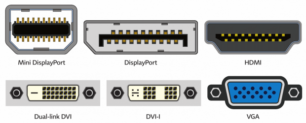

# Lecture Notes: Build a Computer

Use this document to add more details, flavor, hints, tricks, ideas to make lecture better. This should tie into the "Why, What, How" sections of the facilitator's README.

Consider the [README](README.md) in conjunction with the [DEMO](DEMO.md) as the single source of truth for a given class, while this document is more of the living, breathing, set of notes from all instructors as to what is historically working well.

## Review: What is a Computer?

- What is a Computer?
  - Binary & Data
  - Circuits & Logic
  - Lab assignment
- Inside a Computer
  - Disassembly
  - Lab assignment

## Topic 1: Build a Computer

- **Story** (5 min)
- Plugging in a USB thumb drive into a work computer
  - David's Story: I once worked with contracted finance auditors who would visit the company office and bring with them USB drives. At the time, I had USB ports disabled from reading flash drives as part of security policy; IT department would virus scan USB drives before allowing selective use of them. Part of the auditors’ jobs were to screen IT for appropriate security policies regarding the handling of data. The auditors would then proceed to share files via USB, and request me to lift USB port restrictions on computers for the day, so finance employees could share files via USB.
    - Seeing a conflict here? The auditors brought in USB that had not been screened, and requested to lift policy restrictions, despite a part of their core mission being to ensure correct IT policies surrounding financial data.
    - Key Takeaway
      - Sometimes malware can be distributed via portable media like flash drives and portable hard drives, even cell phones plugged in via USB. Very common attack vector.
      - Make sure you know the capabilities of your computer interfaces, and adjust security policy accordingly!

- Why build a computer?
  - Enthusiast PC
  - Component swap or upgrade 
  - Enterprise with on-prem desktops
  - Value - more affordable components
- What types of desktops are there?
  - Gaming
  - CAD Workstation
  - Office
  - Thinclient
- Interfaces
  - Why do commputers have various interfaces?
    - Standards agreed upon by the industry
    - Transfer data
  - Types
    - User interface
    - Software interface
    - Hardware interface
  - In our case we are studying the hardware interface.
  - USB interfaces commonly used for
    - Power charging
    - Data transfer
    

  - USB Security
    - Common peripherals
    - Can be “locked” by security software
    - Threat vector for malware, data exfiltration
    - Can be bootable into an OS
    - We’ll be creating a bootable Ubuntu 20.04 USB 

- Demo bootable USB
  - Show how to create a bootable Ubuntu USB in Windows 10

- Portable Media
  - USB flash drive
  - External hard drive
  - CD-ROM or DVD-ROM disk
    - Uses the “.iso” file extension
    - Commonly, used to install software
  - Magnetic storage devices (obsolete)
    - Tapes, floppy diskette

- Analog VS Digital
  - Both Analog and Digital signals use electricity to transmit information
  - Analog Signal: Information translated into electric pulses of different amplitudes. Examples: VGA interface, old stereo receivers
  - Digital Signal: Information is in binary format (0 and 1) and there are only two amplitudes. Examples: HDMI, modern stereo decks

- Memory
  - How do computers store data?
    - Volatile memory
      - CMOS
      - Random access memory (RAM)
      - Cache memory
    - Non-volatile memory
      - HDD, SSD
      - Read only memory (ROM)
      - Optical
      - Magnetic (Floppy, Tapes)

- Hard drives
  - Platter drive (HDD)
    - Older, slower
    - Cheapter (gap is closing)
  - Solid state drive (SSD)
    - Much faster than HDD
  - M.2 drive
    - Slightly faster than SSD (often not appreciable difference)
    - Most expensive

- Data, Power Interfaces
  - Data interfaces
    - Serial ATA (SATA)
  - Power interfaces
    - Serial ATA (SATA) power
    - Molex
  - Power supply unit (PSU)
    - Convert Alternating Current (AC) to usable Direct Current (DC)
    - Newer units are modular
    - Motherboard, component power

- Build a computer (steps)
  - Setup a PC case and power supply
  - Install the CPU and heatsink + fan to motherboard
  - Install memory components (RAM, SSD/HDD)
  - Install all other components (GPU, Cooling, Sound Card, etc.)
  - Attach power cabling from PSU to component
  - Attach data cabling

- Demo: Build a PC

- Lab

